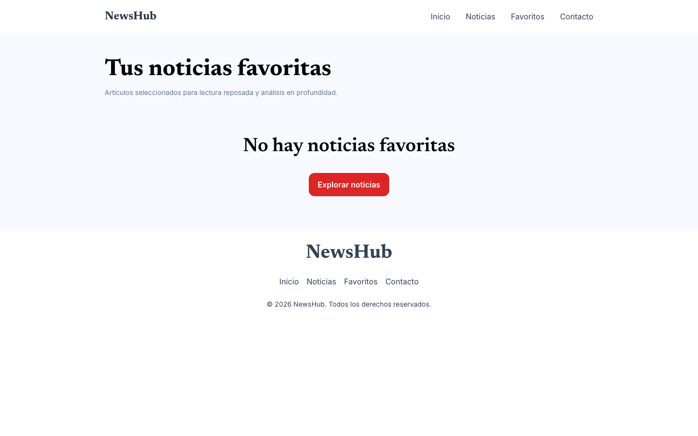
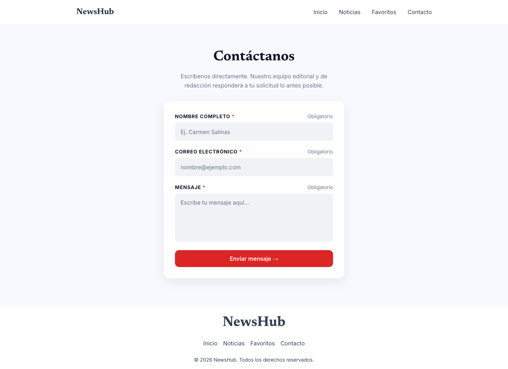
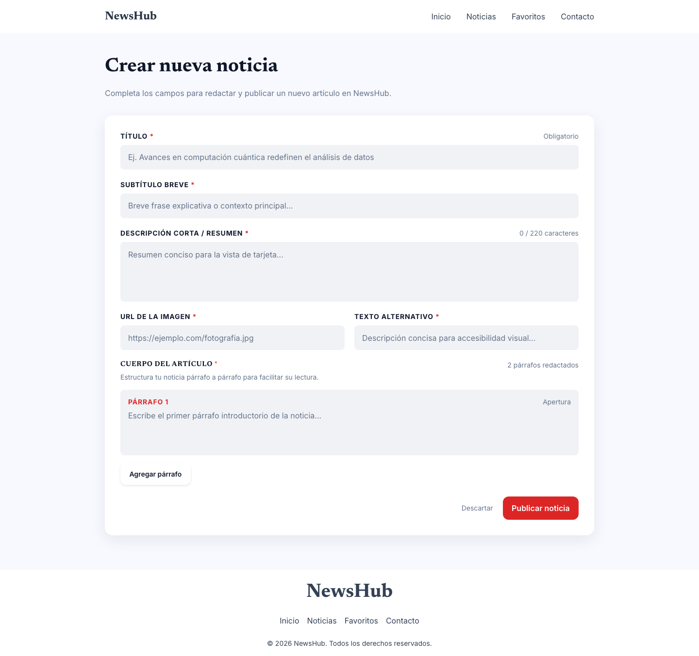

# NewsHub

Plataforma web de noticias para consultar, guardar, crear y eliminar artículos desde el navegador. Es un proyecto académico del módulo de **Desarrollo de Front-end** del Politécnico Grancolombiano.

La aplicación funciona por completo en el cliente: el JSON semilla se carga una vez y a partir de ahí el estado vive en `localStorage`.

## Demo en vivo

[https://frontend-poli.santiagosaavedra.com.co](https://frontend-poli.santiagosaavedra.com.co)

## Tecnologías

- Angular 21 (standalone components, routing, Reactive Forms)
- TypeScript
- CSS con BEM y custom properties
- `localStorage` como capa de persistencia (noticias, favoritos y mensajes de contacto)
- pnpm

## Cómo correr el proyecto localmente

```bash
git clone https://github.com/ssaavedraa/frontend-poli
cd newsHub
pnpm install
pnpm start
```

Abre la URL que imprima el servidor (por ejemplo `http://localhost:4200`).

La primera visita copia `public/data/posts.json` a `localStorage`. Desde ahí, crear, eliminar o marcar favoritos persiste en ese navegador.

Otros comandos:

```bash
pnpm lint
pnpm format
pnpm build
```

## Estructura del proyecto

```text
.
├── public/
│   ├── data/posts.json
│   └── fonts/
├── src/
│   ├── app/
│   │   ├── components/
│   │   ├── domain/
│   │   ├── models/
│   │   ├── pages/
│   │   └── services/
│   ├── index.html
│   ├── main.ts
│   └── styles.css
├── angular.json
└── package.json
```

- `src/app/domain/` contiene reglas de negocio puras: filtrar, ordenar, recortar listados, generar slugs y decidir si un artículo está en favoritos.
- `src/app/services/` habla con el mundo exterior: hidrata el JSON semilla y persiste posts, favoritos y el formulario de contacto en `localStorage`.
- `src/app/pages/` son las vistas de la SPA. `src/app/components/` cubre piezas reutilizables (header, footer, card, hero, dialog, button).

## Decisiones de arquitectura

### Domain separado de services

El dominio no conoce `localStorage` ni el DOM. Funciones como `filterNotDeleted`, `sortByDate`, `slugify` o `isFavorited` reciben datos y devuelven datos.

Si mañana las noticias dejaran de vivir en `localStorage` y pasaran a una API, `domain/` no tendría que cambiar: cambiaría el adaptador en `services/`.

### Services como adaptadores de infraestructura

`PostsService` y `FavoritesService` sí tienen efectos secundarios: leen y escriben claves de `localStorage`, y en el primer arranque hidratan el almacén con `posts.json`. `LocalStorageService` encapsula `getItem` / `setItem` y el parseo JSON.

Las páginas piden datos al servicio, aplican reglas de dominio y recién entonces pintan la plantilla.

### BEM en CSS

Aunque Angular encapsula estilos por componente, las clases siguen BEM (`bloque__elemento--modificador`) para que el markup sea explícito y coincida con el sistema de diseño de la versión vanilla: `.card__title` no pisa `.create__title`.

### Sistema de diseño en `src/styles.css`

Colores, tipografías y tamaños de fuente viven como Custom Properties en `:root`. Las hojas de cada componente consumen esas variables. El reset y las fuentes autohospedadas (Newsreader e Inter) también salen de ahí.

## Capturas de pantalla

Vistas tomadas del [demo en vivo](https://frontend-poli.santiagosaavedra.com.co), en escritorio. Las versiones mobile están en `screenshots/`.

### Inicio


### Listado


### Detalle


### Favoritos



### Contacto



### Crear noticia


